# FAKE.NET Billing and Office ISP

Billing standalone ISP/RT-RW Net berbasis Node.js untuk operasional pelanggan PPP-DHCP, Hotspot voucher, tagihan, monitoring, payment gateway, Whatsapp Gateway, GenieACS, aset, inventaris, dan laporan.

Data runtime tidak disertakan ke repository. Folder `data/` diabaikan oleh Git kecuali `.gitkeep`, sehingga data dev/produksi tidak ikut terupload.

## Quick Install

Gunakan VM/VPS Linux baru. Minimal yang disarankan adalah Ubuntu 22.04 atau distro setara. Jalankan semua perintah sebagai `root`.

### Ubuntu/Debian

```bash
apt update
apt install -y git curl
cd /root
git clone https://github.com/fakehotspot12/FAKE.NET-BILLING.git
cd FAKE.NET-BILLING
bash install.sh
```

### CentOS/Rocky/Alma/Fedora

```bash
dnf install -y git curl
# Jika distro masih memakai yum:
# yum install -y git curl
cd /root
git clone https://github.com/fakehotspot12/FAKE.NET-BILLING.git
cd FAKE.NET-BILLING
bash install.sh
```

### Alpine Linux

```bash
apk add --no-cache git curl bash
cd /root
git clone https://github.com/fakehotspot12/FAKE.NET-BILLING.git
cd FAKE.NET-BILLING
bash install.sh
```

Setelah installer selesai, buka:

```text
http://IP-SERVER:8891
```

Login awal:

```text
username: admin
password: billing123
```

Segera ubah password admin setelah berhasil login.

Port bawaan:

```text
Billing admin : http://IP-SERVER:8891
Web isolir    : http://IP-SERVER:8892/isolir
Beli voucher  : http://IP-SERVER:8893/voucher
WifiKu        : http://IP-SERVER:8894/wifiku
WAHA lokal    : 127.0.0.1:8895
```

Cek status service:

```bash
fakenet-billing-stack status
```

Restart semua service:

```bash
fakenet-billing-stack restart
fakenet-billing-stack restart-app
```

Update aplikasi:

```bash
fakenet-billing-stack update
fakenet-billing-stack clear-update-lock
```

Repair konfigurasi service/FreeRADIUS tanpa hapus data:

```bash
cd /root/FAKE.NET-BILLING
sudo bash install.sh repair
```

Uninstall total:

```bash
cd /root/FAKE.NET-BILLING
sudo bash install.sh uninstall
```

Hal yang perlu diatur setelah install:

- Aktivasi aplikasi melalui halaman aktivasi jika diminta.
- Ubah password admin.
- Isi data usaha, logo, dan subdomain publik jika dipakai.
- Tambahkan Site/NAS, secret Radius, SNMP community, dan profile layanan.
- Atur Payment Gateway.
- Scan Whatsapp Gateway.
- Buat rule MikroTik untuk Radius, isolir, dan redirect web isolir sesuai kebutuhan jaringan.

## Fitur Utama

- Dashboard keuangan, tagihan, PPP-DHCP users, Hotspot users, dan traffic NAS.
- Radius PPP-DHCP dan Hotspot: user, profile, session, import/export, generate voucher, kick session, isolir/aktif/terminate.
- Billing mandiri: invoice otomatis/manual, reminder, bayar, rollback, PDF kuitansi, laporan harian/bulanan.
- Voucher Hotspot online: order dari login page, pembayaran QRIS, generate voucher otomatis setelah paid, dan cetak voucher batch.
- Payment Gateway terpusat untuk paket bulanan dan voucher. Provider awal: Tripay, struktur siap untuk provider lain.
- Whatsapp Gateway API memakai WAHA lokal: template, pesan terkirim, resend, broadcast, dan notifikasi tagihan/voucher.
- Monitoring: Site/NAS, pelanggan online, tagihan pelanggan, member, dan GenieACS.
- Portal publik:
  - Isolir untuk pelanggan yang ditangguhkan.
  - Voucher untuk pembelian voucher Hotspot.
  - WifiKu untuk pelanggan melihat usage bulanan, redaman, ganti SSID/password, dan reboot ONU jika GenieACS aktif.
- Manajemen aset, inventaris, stok, mutasi stok, notifikasi stok/aset bermasalah.
- Role user: admin, owner, finance, teknisi, NOC, collector, reseller voucher, viewer.
- Backup/restore dan update aplikasi dari menu Pengaturan.

## Tampilan Aplikasi

Screenshot berikut memakai data yang disamarkan untuk dokumentasi publik.

| Dashboard | Pelanggan Online |
| --- | --- |
| 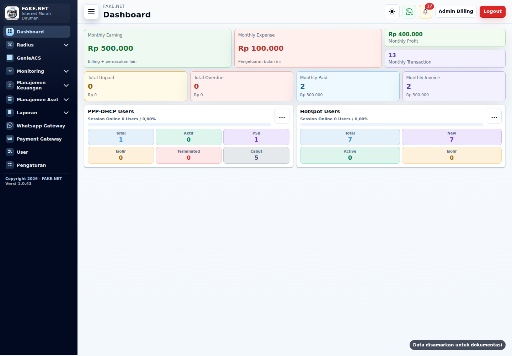 | 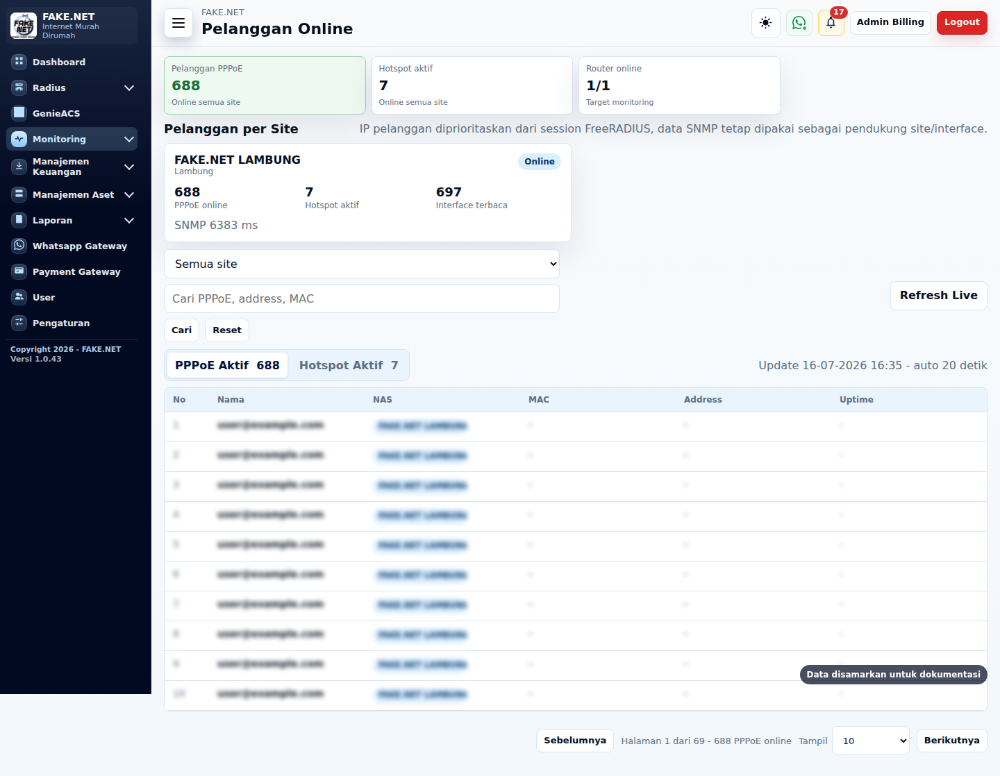 |

| Radius PPP-DHCP | Hotspot Voucher |
| --- | --- |
| 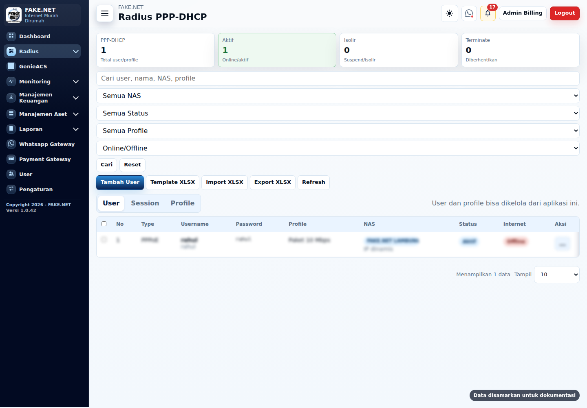 | 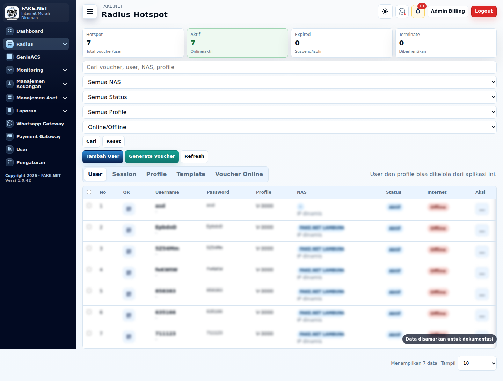 |

| Member | Tagihan Pelanggan |
| --- | --- |
| 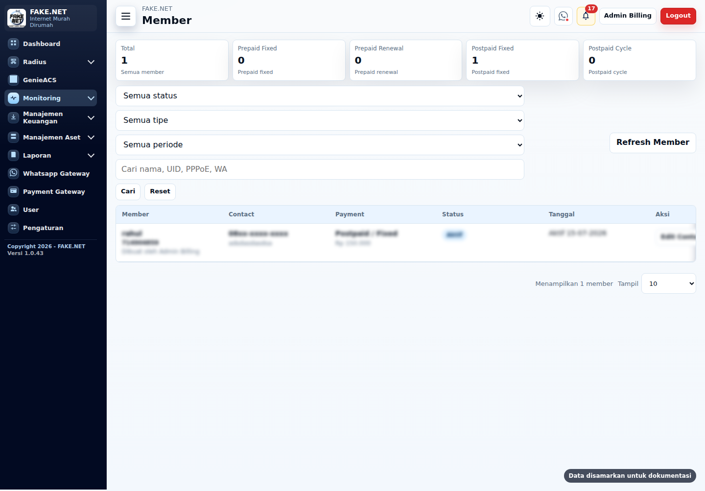 | 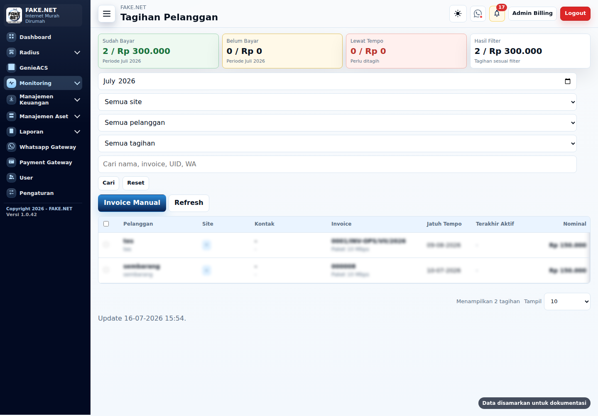 |

| Statistik | GenieACS |
| --- | --- |
| 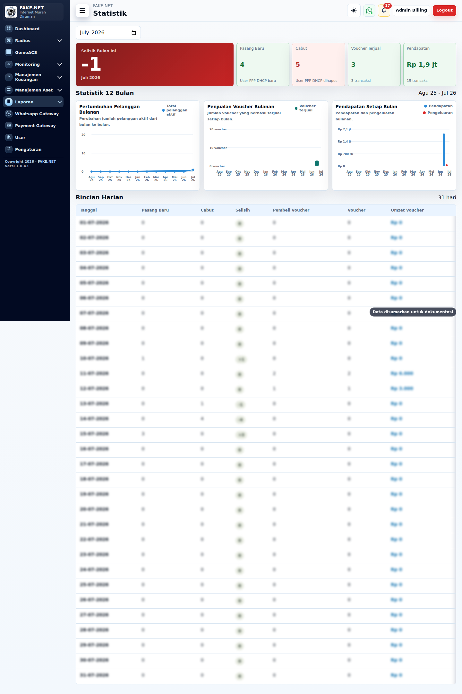 | 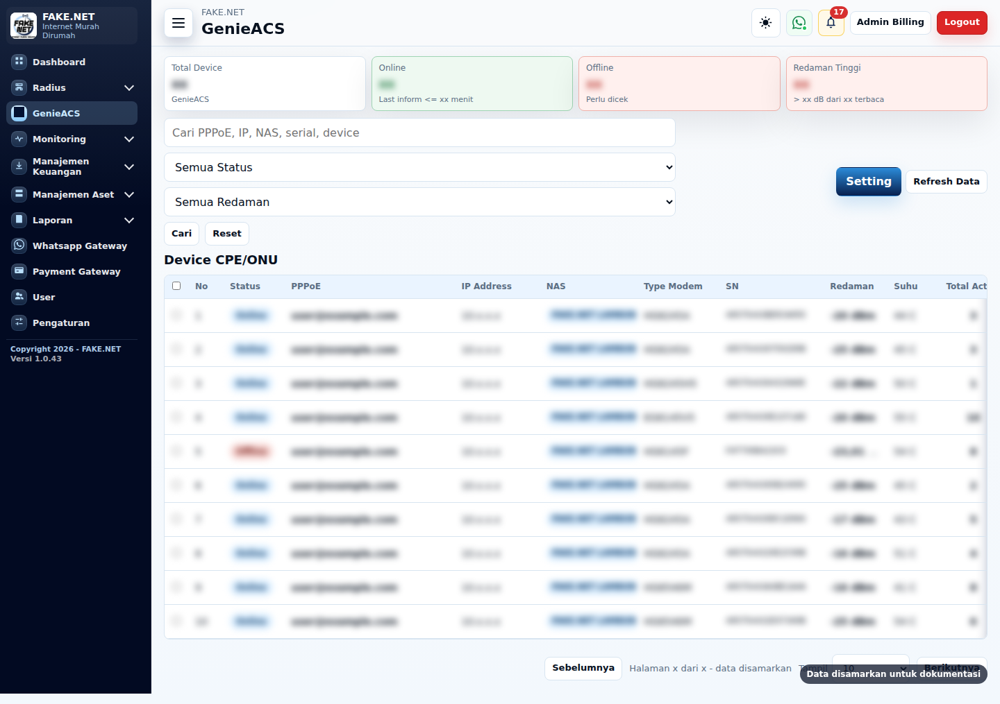 |

| Whatsapp Gateway | Payment Gateway |
| --- | --- |
| 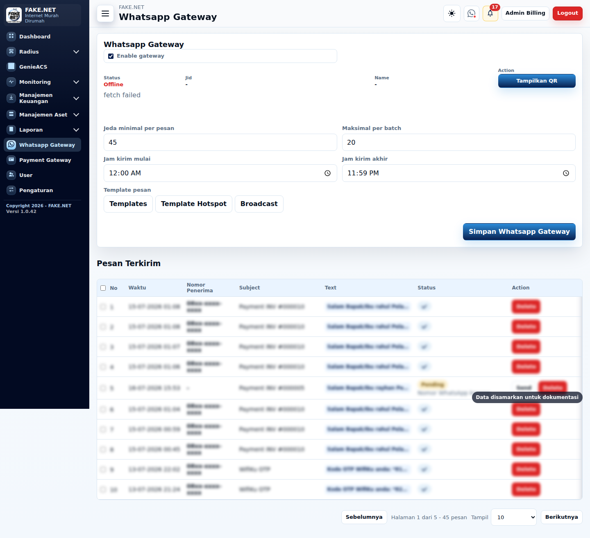 | 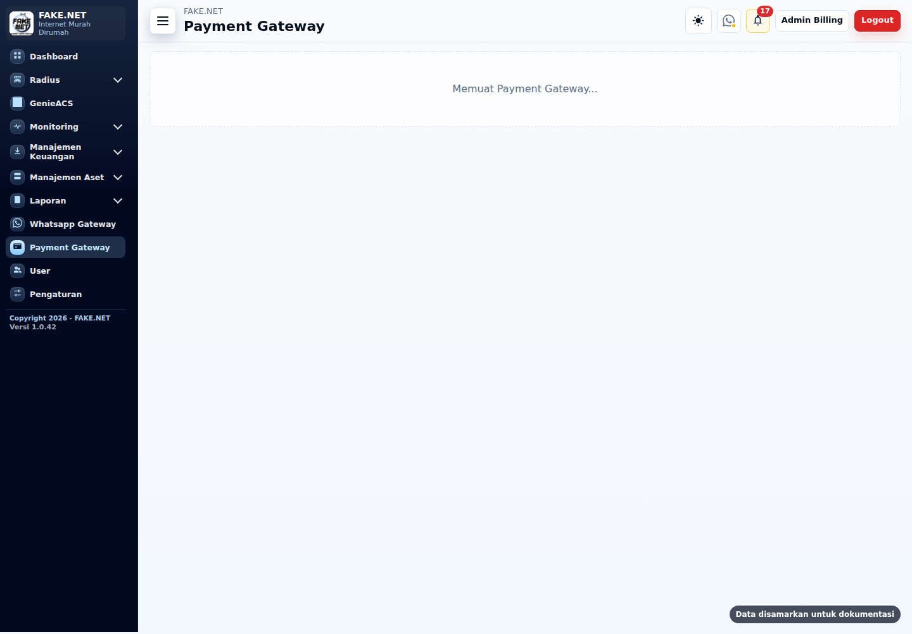 |

| Mobile Dashboard |
| --- |
| 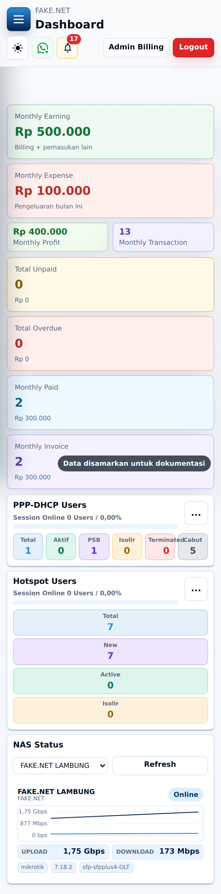 |

## Member PPP-DHCP

Member PPP-DHCP digunakan untuk pelanggan bulanan seperti PPPoE dan DHCP yang ditagihkan secara periodik. Data pelanggan dibuat dari wizard akun, member, payment, dan review sehingga informasi teknis internet, identitas pelanggan, nomor Whatsapp, alamat, titik lokasi peta, foto rumah, profile layanan, NAS, serta detail pembayaran tersimpan dalam satu alur.

Saat user PPP-DHCP dibuat, aplikasi dapat sekaligus membuat data member dengan ID pelanggan otomatis. Profile PPP-DHCP menyimpan harga paket, mode billing, VAT, diskon, dan parameter bandwidth atau link ke profile Mikrotik. Data autentikasi dan session menggunakan FreeRADIUS, sehingga status online/offline, kick session, suspend, aktif kembali, dan terminated tidak hanya tampil di aplikasi tetapi juga terkait dengan backend Radius.

Alur operasional member PPP-DHCP:

1. Admin, NOC, teknisi, collector, atau role yang diberi izin membuat atau mengubah user PPP-DHCP sesuai kewenangannya.
2. Sistem menyimpan data akun internet, data kontak member, detail pembayaran, dan profile layanan.
3. Invoice dapat dibuat otomatis sesuai billing setting atau manual dari menu tagihan.
4. Reminder tagihan dikirim melalui Whatsapp Gateway berdasarkan template yang bisa diatur.
5. Pembayaran bisa dicatat manual oleh user berwenang atau diterima otomatis dari payment gateway.
6. Jika invoice sudah paid, pelanggan tetap aktif dan tidak ikut proses isolir.
7. Jika melewati jatuh tempo sesuai pengaturan, sistem dapat melakukan isolir otomatis dan mengirim notifikasi.
8. Pelanggan yang sudah membayar setelah isolir dapat diaktifkan kembali, termasuk trigger session/COA Radius bila tersedia.

Data lokasi pelanggan dapat disimpan dari izin lokasi browser atau ditandai manual pada peta. Foto rumah pelanggan disimpan sebagai referensi lapangan agar teknisi, NOC, dan collector lebih mudah menemukan titik pemasangan, memverifikasi pelanggan pindah alamat, atau melengkapi data saat kunjungan. Di menu Member, data kontak, alamat, peta, foto rumah, detail internet, dan invoice dibuat mudah ditinjau tanpa membuka banyak halaman.

Monitoring member PPP-DHCP memuat status pelanggan, status pembayaran, NAS, kontak, alamat, invoice, serta data pendukung untuk pekerjaan lapangan. Portal WifiKu dapat digunakan pelanggan untuk melihat pemakaian bulanan, redaman, dan aksi perangkat jika integrasi GenieACS aktif.

## Metode Pembayaran Member

Billing member memakai kombinasi `Payment Type` dan `Billing Period`. Pilihan periode billing dibatasi berdasarkan tipe pembayaran agar skema tagihan tidak rancu.

| Payment Type | Billing Period | Sumber jatuh tempo | Cara kerja invoice | Cocok untuk |
| --- | --- | --- | --- | --- |
| Postpaid | Fixed Date | Tanggal jatuh tempo milik member, biasanya mengikuti tanggal aktif/pasang pelanggan. | Pelanggan memakai layanan lebih dulu. Invoice dibuat sesuai tanggal member tersebut, lalu pembayaran dicatat manual atau otomatis dari payment gateway. | Pelanggan bulanan yang tanggal tagihannya berbeda-beda mengikuti tanggal pasang. |
| Postpaid | Billing Cycle | Tanggal global `Due date postpaid` di `Radius > Setting > Billing Setting`. | Semua pelanggan cycle ditarik ke tanggal jatuh tempo yang sama. Jika pelanggan aktif sebelum/sesudah tanggal cycle, invoice pertama dapat prorata, lalu periode berikutnya full bulanan. | ISP yang ingin semua tagihan jatuh pada tanggal seragam, misalnya tanggal 10 atau 15 setiap bulan. |
| Prepaid | Fixed Date | Tanggal jatuh tempo milik member. | Pelanggan bayar dulu untuk periode tanggal tetap. Jika invoice awal `Unpaid`, layanan belum dianggap aman sampai pembayaran dicatat `Paid`. | Pelanggan prabayar yang tetap memakai tanggal jatuh tempo tertentu. |
| Prepaid | Renewal | Masa aktif/expired terakhir pelanggan, lalu diperpanjang setelah pembayaran berikutnya. | Pelanggan bayar dulu, lalu masa aktif diperbarui dari periode renewal. Tidak memakai tanggal cycle global. | Skema prabayar berbasis perpanjangan masa aktif, mirip voucher/langganan yang diperpanjang ketika bayar. |

Kombinasi yang tidak sesuai tidak digunakan. `Postpaid + Renewal` dan `Prepaid + Billing Cycle` akan dinormalisasi ke `Fixed Date` agar data tetap aman dan invoice tidak dibuat dengan aturan yang salah.

### Billing Cycle dan Prorata

Untuk `Postpaid + Billing Cycle`, tanggal jatuh tempo mengikuti pengaturan `Due date postpaid` di menu `Radius > Setting > Billing Setting`. Jika pelanggan baru aktif sebelum atau sesudah tanggal cycle, invoice pertama dihitung prorata dari `Active Date` sampai tanggal jatuh tempo cycle pertama. Setelah invoice pertama, tagihan berikutnya kembali normal full bulanan.

Contoh:

```text
Harga paket       : Rp150.000
Active Date       : 20/07/2026
Billing Cycle     : tanggal 15
Jatuh tempo awal  : 15/08/2026
Jumlah hari       : 27 hari
Tagihan awal      : Rp150.000 x 27 / 30 = Rp135.000
```

Invoice berikutnya setelah periode prorata akan memakai nominal full `Rp150.000` per bulan, kecuali ada VAT/PPN atau diskon pada data member. Jika VAT/PPN dan diskon diisi, aplikasi menghitungnya dari subtotal tagihan periode tersebut, termasuk subtotal prorata.

### Billing Setting

Field tanggal di Billing Setting berfungsi sebagai berikut:

- `Due date postpaid`: tanggal jatuh tempo global untuk `Postpaid + Billing Cycle`.
- `Generate invoice sebelum tempo`: jumlah hari sebelum jatuh tempo saat invoice otomatis mulai dibuat. Nilai `1` berarti H-1, nilai `0` berarti tepat hari jatuh tempo.
- `Reminder sebelum tempo`: jumlah hari sebelum jatuh tempo untuk mengirim pengingat Whatsapp. Nilai `0` berarti reminder otomatis dimatikan.
- `Grace suspend setelah tempo`: masa tenggang setelah jatuh tempo sebelum pelanggan diisolir otomatis. Nilai `0` berarti auto isolir karena telat bayar dimatikan.
- `Terminate otomatis setelah isolir`: jumlah hari sejak isolir otomatis sebelum akun PPP-DHCP diubah menjadi terminated. Nilai `0` adalah default: pelanggan tetap isolir dan invoice periode berikutnya terus diterbitkan.
- `Jam isolir otomatis`: jam eksekusi isolir otomatis setelah masa tenggang terpenuhi.

Invoice otomatis dibuat per pelanggan sesuai tanggal jatuh temponya masing-masing. Untuk pelanggan prorata Billing Cycle, invoice pertama tidak dibuat sebelum `Active Date`, meskipun window generate invoice sudah masuk H-minus jatuh tempo.

Jika batas terminate diisi lebih dari `0`, hanya isolir yang dibuat sistem karena tunggakan yang dapat berubah otomatis menjadi terminated. Isolir manual oleh admin tidak ikut diproses. Setelah terminated, invoice baru berhenti dibuat tetapi invoice terakhir yang belum lunas tetap tersimpan dan dapat dibayar. PPP-DHCP terminated tetap diarahkan ke profile/group isolir Radius agar halaman isolir dan tombol pembayaran dapat diakses. Pembayaran tidak langsung mengaktifkan akun terminated; aktivasi kembali harus dikonfirmasi admin. Voucher Hotspot terminated tetap diblokir dan tidak mendapatkan akses portal.

## Voucher Hotspot

Voucher Hotspot dirancang untuk operasional jual voucher harian/mingguan/bulanan tanpa input manual berulang. Admin atau reseller dapat membuat voucher satuan maupun batch dari profile Hotspot yang sudah memiliki harga, validity, quota, shared user, NAS, dan expired mode.

Alur voucher online:

1. Pelanggan membuka halaman beli voucher dari subdomain/port Voucher.
2. Pelanggan memilih paket voucher Hotspot yang tersedia.
3. Sistem membuat order dan mengarahkan pembayaran ke payment gateway.
4. Untuk voucher online, metode pembayaran dipatenkan ke QRIS.
5. Setelah payment gateway mengirim status paid ke webhook, sistem membuat voucher otomatis dengan format username sama dengan password.
6. Voucher dapat dikirim melalui Whatsapp Gateway jika notifikasi voucher diaktifkan.
7. Transaksi voucher paid masuk ke laporan voucher harian/bulanan dan pendapatan reseller sesuai role pembuat voucher.

Pada instalasi multi-site, tautan beli voucher di setiap captive portal wajib membawa NAS tujuan agar paket dan voucher tidak bercampur antar-site. Nilainya dapat memakai ID, nama, atau alamat NAS yang terdaftar, misalnya:

```text
http://IP-SERVER:8893/voucher?nas=FAKE.NET
http://IP-SERVER:8893/voucher?nas=KAMPUNG.NET
```

Portal mengunci paket dan order ke NAS tersebut. Jika parameter `nas` tidak ada, portal tidak menampilkan paket global dan meminta pelanggan memilih site sebagai fallback.

Voucher batch untuk operasional loket/reseller dapat dicetak langsung dari aplikasi. Format print dibuat ringkas agar satu kertas A4 dapat memuat banyak voucher, lengkap dengan nama usaha, paket, harga, tanggal, jam, QR code, dan link login Hotspot.

Untuk role reseller voucher, data dibuat terpisah berdasarkan pembuat voucher dan NAS yang dikunci pada user tersebut. Reseller hanya melihat, mencetak, dan mengelola voucher yang dibuat olehnya sendiri, sehingga stok voucher, transaksi, dan pendapatan reseller tidak tercampur dengan reseller lain. Admin dan role yang diberi kewenangan lebih tinggi tetap dapat melakukan audit sesuai kebutuhan operasional.

Expired mode mengikuti profile Hotspot, misalnya `None`, `Remove`, `Remove & Record`, `Notice`, dan `Notice & Record`. Mode `Remove & Record` akan menghapus user voucher setelah masa aktif habis tetapi tetap menyimpan record laporan, sedangkan mode notice mempertahankan data user dengan status yang sesuai.

## Manajemen Aset

Manajemen Aset dipakai untuk mencatat perangkat, tools, dan stok barang yang umum dipakai operasional ISP/RT-RW Net. Menu ini memisahkan aset tetap dan inventaris stok agar perangkat server, router, switch, OLT/ONU cadangan, alat kerja teknisi, modem, splitter, adaptor, patchcord, barrel FO, selongsong, solasi, baterai, dan barang habis pakai lain dapat dipantau rapi.

Inventaris memiliki master stok dan mutasi masuk/keluar. Saat teknisi atau admin mengambil barang untuk pemasangan, perbaikan, atau penggantian perangkat, stok dapat dikurangi dari aplikasi dan tercatat siapa yang melakukan update. Jika stok ditambah dari pembelian atau pengembalian barang, mutasi masuk ikut tersimpan. Laporan stok inventaris membantu melihat pergerakan barang tanpa mencampurnya dengan laporan keuangan utama.

Aset digunakan untuk barang yang perlu dilacak kondisinya, misalnya perangkat di server, perangkat jaringan, atau tools kerja. Status seperti baik, rusak, hilang, atau perlu pengecekan dapat dipakai sebagai dasar notifikasi. Jika ada barang rusak/hilang atau stok inventaris hampir habis, aplikasi menampilkan notifikasi untuk role yang berwenang agar pengadaan atau perbaikan bisa cepat ditindaklanjuti.

Role barang dapat disesuaikan: teknisi dapat mengelola kebutuhan lapangan, admin dapat mengaudit dan mengatur master data, sedangkan role lain hanya melihat sesuai izin. Data aset dan inventaris ikut dalam backup aplikasi sehingga tetap aman saat pindah mesin atau restore.

## Port Default

| Service | Port | Keterangan |
| --- | ---: | --- |
| Billing admin | 8891 | Aplikasi utama |
| Isolir | 8892 | Web pelanggan isolir |
| Voucher | 8893 | Web beli voucher |
| WifiKu | 8894 | Portal pelanggan |
| WAHA lokal | 8895 | Whatsapp API lokal, bind ke 127.0.0.1 |

Contoh subdomain:

- `billing.example.net` -> `SERVER:8891`
- `isolir.example.net` -> `SERVER:8892`
- `voucher.example.net` -> `SERVER:8893`
- `wifiku.example.net` -> `SERVER:8894`

## Kebutuhan Sistem

Minimal setara Ubuntu 22.04:

- Linux x86_64/arm64
- Node.js 18+
- npm
- PostgreSQL
- Redis sebagai cache dan backend antrean BullMQ
- FreeRADIUS
- Docker untuk WAHA
- Git, curl, rsync, tar, gzip

`install.sh` mendukung keluarga:

- Debian/Ubuntu dengan `apt`
- CentOS/RHEL/Rocky/Alma/Fedora dengan `dnf`/`yum`
- Alpine Linux dengan `apk` dan OpenRC

Pada RHEL-family, installer akan mencoba mengaktifkan repository pendukung seperti EPEL dan CRB/PowerTools agar paket FreeRADIUS PostgreSQL tersedia. Installer juga menyesuaikan nama service otomatis, misalnya `redis-server`/`redis` dan `freeradius`/`radiusd`, sehingga stack tetap bisa start di distro yang berbeda.

## Install

Jalankan dari folder project:

```bash
sudo bash install.sh
```

Default install ke:

```bash
/opt/fakenet-billing
```

Yang dikerjakan otomatis oleh `install.sh`:

- Install paket OS yang dibutuhkan: Node.js 18+, npm, PostgreSQL, Redis, FreeRADIUS, Docker, Git, curl, rsync, tar, dan gzip.
- Jika Node.js bawaan distro terlalu lama, installer mencoba memasang Node.js 20 dari repository NodeSource.
- Copy source aplikasi ke `/opt/fakenet-billing` tanpa membawa data runtime.
- Install dependency Node dari `package-lock.json`.
- Memasang dan memverifikasi BullMQ; antrean WhatsApp memakai Redis yang sama tanpa field konfigurasi tambahan di UI.
- Memasang dan memverifikasi Web Push; kunci VAPID dibuat otomatis saat dipakai pertama kali dan disimpan persisten di `data/`.
- Memvalidasi kelengkapan source, lockfile, service worker, manifest, SQL FreeRADIUS, helper command, dan unit service sebelum instalasi dilanjutkan.
- Membuat `/etc/fakenet-billing.env` dan `/etc/fakenet-billing-waha.env`.
- Membuat password random untuk database aplikasi, database Radius, dan WAHA.
- Membuat database PostgreSQL `fakenet_billing` dan `radius`.
- Membuat schema FreeRADIUS dasar: `nas`, `radcheck`, `radreply`, `radusergroup`, `radgroupcheck`, `radgroupreply`, dan `radacct`.
- Mengaktifkan konfigurasi SQL PostgreSQL FreeRADIUS, termasuk `read_clients = yes` agar Site/NAS dari aplikasi dibaca sebagai client Radius.
- Memasang service Billing, Isolir, Voucher, WifiKu, Radius Connector, dan WAHA.
- Memasang command stack `fakenet-billing-stack`.
- Menyesuaikan unit systemd atau OpenRC sesuai distro yang dipakai.
- Menjalankan health check aplikasi dan worker BullMQ sebelum instalasi dinyatakan selesai.

Yang tetap perlu diatur setelah install:

- Aktivasi aplikasi jika diminta oleh penyedia.
- Domain/subdomain publik dan HTTPS reverse proxy jika aplikasi dipublish ke internet.
- HTTPS wajib untuk notifikasi pembayaran pada Chrome/mobile. Pada iPhone/iPad, portal perlu ditambahkan ke Home Screen agar Web Push tersedia.
- Payment gateway merchant key, private key, dan callback domain.
- Scan Whatsapp API Gateway dari menu aplikasi.
- Site/NAS, secret Radius, SNMP community, profile PPP-DHCP/Hotspot, dan rule MikroTik.

Env utama:

```bash
/etc/fakenet-billing.env
/etc/fakenet-billing-waha.env
```

## Service

Systemd:

```bash
fakenet-billing-stack start
fakenet-billing-stack restart
fakenet-billing-stack stop
fakenet-billing-stack status
fakenet-billing-stack update
```

Service utama:

- `fakenet-billing.service`
- `fakenet-billing-isolir.service`
- `fakenet-billing-voucher.service`
- `fakenet-billing-wifiku.service`
- `fakenet-billing-radius-connector.service`
- `fakenet-billing-waha.service`

Worker BullMQ Whatsapp berjalan di dalam `fakenet-billing.service`. Billing Setting tetap menentukan kapan invoice, reminder, isolir, aktivasi, dan notifikasi dibuat. Menu Whatsapp Gateway tetap menjadi pengendali enable, jeda minimum, maksimum per batch, jam kirim, serta template. WAHA berfungsi sebagai pengirim, sedangkan BullMQ menyimpan jadwal dan retry di Redis dengan concurrency satu.

BullMQ membantu menjaga urutan, retry, dan laju pengiriman. BullMQ maupun WAHA tidak menjamin akun WhatsApp bebas pembatasan; gunakan nomor yang memiliki persetujuan penerima, hindari pesan berulang, dan pertahankan jeda serta jam kirim yang wajar.

## Update Aman

Update dari web:

1. Login sebagai admin.
2. Buka `Pengaturan`.
3. Klik `Update Aplikasi`.

Update dari terminal:

```bash
sudo fakenet-billing-stack update
```

Updater akan:

1. Membuat backup pre-update ke `/var/backups/fakenet-billing`.
2. Backup mencakup `data/`, env `/etc/fakenet-billing.env`, env WAHA, metadata source, serta dump PostgreSQL aplikasi dan Radius jika `pg_dump` tersedia.
3. Mengambil source terbaru via Git jika folder punya `.git`.
4. Atau memakai `FAKENET_UPDATE_ARCHIVE_URL` jika install dari archive.
5. Menjalankan `npm ci --omit=dev` atau `npm install --omit=dev`.
6. Memverifikasi modul BullMQ dan Web Push sebelum service direstart.
7. Restart service aplikasi tanpa me-restart Redis, PostgreSQL, Docker, atau FreeRADIUS.
8. Menjalankan repair ringan untuk menyelaraskan helper command, systemd unit, dan konfigurasi FreeRADIUS tanpa menghapus data.
9. Memastikan health check aplikasi dan worker BullMQ berhasil sebelum update dinyatakan selesai.

Updater memakai aksi internal `restart-app`, sehingga Redis, PostgreSQL, Docker, dan FreeRADIUS tidak direstart saat pembaruan source. Perintah `restart` tetap tersedia untuk restart penuh ketika memang diperlukan oleh administrator.

Data aplikasi di `data/` tidak dihapus oleh updater. Untuk install PostgreSQL, file backup berisi:

- `db/fakenet_billing.dump`
- `db/radius.dump`
- `etc/fakenet-billing.env`
- `etc/fakenet-billing-waha.env`
- `manifest.txt`

Log update:

```bash
/var/log/fakenet-billing/update.log
```

### Jika Update Dari Web Tidak Berjalan

Pada versi lama, halaman `Pengaturan > Update Aplikasi` bisa masih menampilkan format seperti:

```text
Update tersedia
Klik Update Aplikasi untuk mengambil versi terbaru tanpa menghapus data.
Terpasang: 374268b | GitHub: ef02779 | Branch: main
```

Tombol update web tetap bisa dipakai selama proses updater tidak terkunci. Jika setelah klik update versi tidak berubah, jalankan perbaikan sekali dari terminal server:

```bash
sudo fakenet-billing-stack clear-update-lock
sudo fakenet-billing-stack update
```

Setelah server berhasil naik ke versi baru, updater sudah otomatis membersihkan lock basi dan update berikutnya bisa dilakukan dari web.

Khusus instalasi `v1.1.2` atau lebih lama yang belum memiliki perbaikan updater, lakukan bootstrap satu kali dari terminal:

```bash
curl -fsSL https://raw.githubusercontent.com/fakehotspot12/FAKE.NET-BILLING/main/bootstrap-update.sh | sudo bash
```

Bootstrap memvalidasi lock, menghapus lock stale, lalu mengambil updater terkini tanpa memakai helper lama. Mulai `v1.2.1`, update dari web berjalan pada transient systemd unit sehingga tetap hidup ketika service aplikasi direstart dan lock dibersihkan saat proses selesai.

#### Clean Lock Update

Gunakan ini jika halaman update menampilkan update tersedia, tetapi versi tidak berubah setelah tombol `Update Aplikasi` dipencet, atau log berisi `Update lain masih berjalan`.

```bash
sudo fakenet-billing-stack clear-update-lock
sudo fakenet-billing-stack update
```

Perintah pertama hanya menghapus lock stale dan akan menolak bila updater masih benar-benar aktif. Perintah kedua menjalankan update normal, tetap membuat backup pre-update, lalu restart service aplikasi.

Untuk audit cepat:

```bash
cd /opt/fakenet-billing
git rev-parse --short HEAD
node -p "require('./package.json').version"
sudo systemctl status fakenet-billing --no-pager
sudo tail -100 /var/log/fakenet-billing/update.log
```

Jika `fakenet-billing-stack update` masih gagal, cek poin berikut:

- Server harus bisa akses repository Git yang digunakan saat install.
- Folder `/opt/fakenet-billing` harus berupa Git checkout jika update memakai Git.
- Jangan edit file source tracked langsung di server client. Data aplikasi tetap aman karena berada di `data/` atau database dan tidak ikut ditimpa updater.
- Jika ada perubahan tracked lokal, updater akan mencoba menyimpannya ke Git stash sebelum `pull`.

## Uninstall Total

Gunakan uninstall total jika ingin menghapus aplikasi dari mesin yang sama, misalnya sebelum install ulang dari awal. Perintah ini menghapus service aplikasi, source di `/opt/fakenet-billing`, env, database aplikasi, database Radius, session WAHA, log, backup, dan command helper `fakenet-billing-stack`/`fakenet-billing-update`.

```bash
cd /root/FAKE.NET-BILLING
sudo bash install.sh uninstall
```

Untuk proses non-interaktif:

```bash
sudo FAKENET_UNINSTALL_CONFIRM=YES bash install.sh uninstall
```

Atau:

```bash
sudo bash install.sh uninstall --yes
```

Wrapper khusus dengan hasil yang sama juga tersedia:

```bash
sudo bash /opt/fakenet-billing/uninstall.sh
sudo bash /opt/fakenet-billing/uninstall.sh --yes
```

Yang dihapus:

- `/opt/fakenet-billing`
- `/opt/fakenet-billing-waha`
- `/etc/fakenet-billing.env`
- `/etc/fakenet-billing-waha.env`
- `/var/log/fakenet-billing`
- `/var/backups/fakenet-billing`
- Database PostgreSQL `fakenet_billing` dan `radius`
- Role PostgreSQL aplikasi dan Radius
- Service `fakenet-billing*`
- Helper `/usr/local/bin/fakenet-billing-stack` dan `/usr/local/bin/fakenet-billing-update`
- Seluruh key antrean Redis dengan prefix khusus `fakenet-billing:bullmq`; key Redis aplikasi lain tidak disentuh

Paket OS seperti PostgreSQL, Redis, FreeRADIUS, Docker, Node.js, Git, dan curl tidak dihapus karena bisa dipakai aplikasi lain.

## Backup dan Restore

Dari aplikasi:

- `Pengaturan` -> `Download Backup`
- `Pengaturan` -> `Restore Backup`

Backup memuat data penting aplikasi seperti user, member, Radius, invoice, transaksi, inventaris, aset, WA Gateway, payment gateway, dan konfigurasi.

## Catatan Payment Gateway

Halaman login memuat informasi publik yang dibutuhkan untuk review payment gateway:

- Produk layanan yang dijual.
- Ringkasan syarat dan ketentuan.
- Kontak customer service sesuai data usaha.

Untuk Tripay, callback/webhook default:

```text
https://billing-domain.example.net/api/payment-gateway/webhook
```

Satu webhook dipakai untuk pembayaran voucher dan paket bulanan. Voucher dikunci ke QRIS, paket bulanan mengikuti channel yang diaktifkan di provider.

## GitHub Release

Sebelum upload ke GitHub:

- Pastikan `data/store.json` tidak ikut commit.
- Pastikan `/etc/*.env` tidak ikut commit.
- Pastikan private key dan kredensial produksi tidak ada di repository.
- Gunakan `.env.example` dan file `deploy/*.env` sebagai template saja.

Default user untuk install baru dibuat otomatis jika data masih kosong:

```text
username: admin
password: billing123
```

Segera ubah password setelah login pertama.
